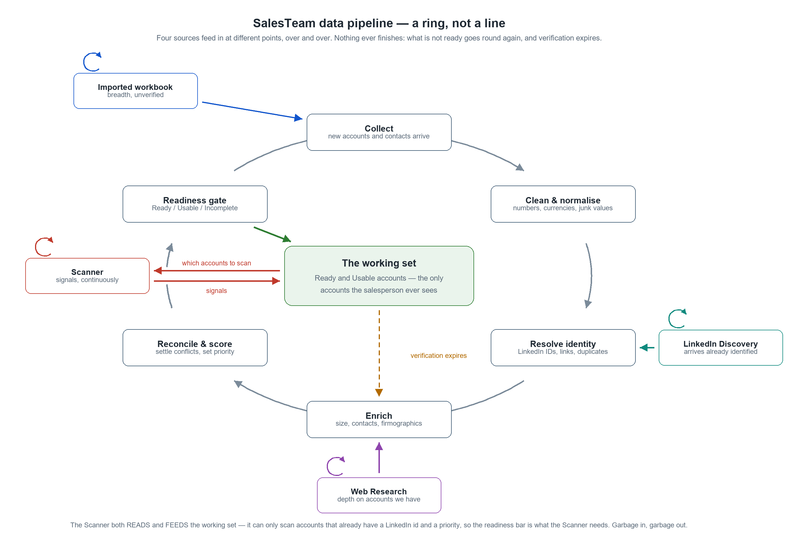

# SalesTeam — Data Pipeline & Readiness: Requirements

Target release: **1.2.0**
Status: **Requirements — agreed 2026-09-24.** Design and implementation follow separately.
Date: 2026-09-22 (review afterthoughts added 2026-09-24, section 12 and Appendix A)

---

## 1. Why this exists

SalesTeam has accumulated roughly a dozen data-maintenance actions — Import Research Workbook,
Resolve LinkedIn Company IDs, Fetch Company Size, Discover Contacts, Find & Merge Duplicates,
Extract Companies, Extract Companies & Locations from Profiles, Research Accounts on the Web,
Resolve Web Findings Automatically, Prioritize Companies, Prioritize Unscored Leads, Re-score All
Priorities, Apply Location Filter.

Each one was justified on its own. Together they are an operations manual rather than a product.

**These are not twelve tools. They are one pipeline with a dependency graph, exposed as twelve
nouns.** The ordering between them is real, not arbitrary: a company's size cannot be fetched
without a LinkedIn link, the link comes from the resolver, and prioritisation must run last because
it reads what all the others wrote. The user has been handed a build system in the shape of a menu
and asked to be the scheduler.

No salesperson can reasonably be expected to know that after an import they should run actions 2,
4, 5, 7, 8 and 9 in that order, then spend hours monitoring and reviewing the results.

**The decisive fact that makes this fixable: the system already knows when each job has work to
do.** `getTargetAccountsMissingLinkedinId()`, `getCompaniesNeedingSize()`,
`getExistingCompaniesNeedingContacts()` and their siblings already answer "is there anything
outstanding?" Nothing needs to be asked of the user to find that out.

**This is a redesign of the workflow, not of the work.** The code that does the actual work already
exists and largely stays. What changes is what decides to run it, when, and what the user is shown.

---

## 2. The product promise

> SalesTeam delivers a **verified, quality-controlled set of accounts, contacts and leads** that a
> salesperson can act on without having to check it first.

Two failure modes sit either side of that promise, and the requirements below exist to avoid both:

- **Shipping unreliable data.** Half-cleaned, half-complete data with missing priorities, absent
  LinkedIn profiles and unknown company sizes will not make customers happy, and quietly destroys
  trust in everything else the tool says.
- **Making the customer wait.** A new user who has just paid for SalesTeam cannot be told to come
  back in a week while their data is processed.

**The stated preference, which drives the whole design: a smaller understood subset of solid,
cleaned, verified data beats a large set with critical fields missing.** 100 reliable accounts is a
better product than 500 unreliable ones.

---

## 3. Core concept: readiness is a property of each account, not a phase of the project

This is the idea that resolves the tension in section 2, and most of the requirements follow from it.

Readiness is **not** a global state the whole dataset passes through. It is computed per account
from which fields are present and verified. Each account is therefore in one of:

| State | Meaning | Shown to the user? |
|---|---|---|
| **Ready** | Every field needed to work the account is present and verified. | Yes — this is the working set. |
| **Usable** | Enough to act on (identity, LinkedIn, at least one contact, a priority), with some enrichment still missing. | Yes, marked as such. |
| **Incomplete** | A critical field is missing or unverified. | No — it is in the pipeline, not in the user's way. |

**Consequence: the user does not wait for all 500 accounts. They start working the moment the first
ones cross the bar, and the working set grows underneath them.** The pipeline runs continuously in
the background; readiness is recomputed as data arrives. Time-to-first-value becomes hours, not a
week, without ever showing anyone a half-finished account.

This also gives the quality bar a place to live that is enforceable rather than aspirational: a
field either meets the standard or the account is not offered as Ready.

### 3.1 What "Ready" means, concretely: whatever the Scanner needs

The bar is not a matter of taste. **The Scanner is the product's main advantage, it is the one
source we want every user to run, and it can only work on accounts that are already complete
enough.** Garbage in, garbage out: the quality of the leads it finds is bounded by the quality of
the accounts it was given. So the definition of Ready is simply *what the Scanner requires*.

That is already written down in code rather than opinion. `getScanTargetCompanyIds()`
(`storage.js`) selects the accounts a scan will actually cover, and it filters on exactly:

- a resolved **`linkedinCompanyId`** — without one the account is invisible to the Scanner, full stop;
- a **`salesTeamPriority`** of P1–P5 within the chosen scope — an unscored account is invisible at
  every scope except "all";
- present in the workbook, not deleted, not excluded.

And because priority is itself computed from **`globalEmployees`** and **`globalHqCountry`**
(`computeCompanyDeterministicPreScore`), those two fields are transitively required as well — an
account with a priority derived from missing firmographics has a number, but not a trustworthy one.

**R3.1** — An account is **Incomplete** when the Scanner cannot see it at all: no resolved LinkedIn
company id, or no priority.

**R3.2** — An account is **Usable** when the Scanner can include it — id and priority both present —
but its priority rests on unverified or missing employee count or HQ country, or it has no contacts.

**R3.3** — An account is **Ready** when the Scanner can include it, its priority rests on *verified*
employee count and HQ country, and it has at least one contact with a LinkedIn profile, so that a
post's author can be matched to a known person rather than only to a company.

**R3.4** — The readiness bar and the Scanner's selection must be derived from **one** definition. If
they are allowed to drift, the tool will promise accounts as Ready that the Scanner then silently
skips — the most damaging failure available to us, because it is invisible.

### 3.2 The field tiers — and why two of them are conditional

Not every field earns the same standing, and the interesting discovery is that **some fields are
mandatory only because of how the user configured their own targeting.** The readiness bar is
therefore *computed from the Setup wizard's configuration*, not hardcoded.

| Field | Tier | Why |
|---|---|---|
| `linkedinCompanyId` | **Mandatory** | No id, no scan. Absolute. |
| `salesTeamPriority` | **Mandatory** | Unscored accounts are outside every scope but "all". |
| `globalHqCountry` | **Mandatory *if* a target region is set** | Feeds `resolveLocationPriority`. If the user targets the whole world with no location priorities, it gates nothing. |
| `globalEmployees` | **Mandatory *if* size priorities are set** | Feeds `resolveSizeBucket`. |
| `industry` | **Mandatory *if* industry priorities are set** | `computeCompanyDeterministicPreScore` only reads it when `targetUniverseConfig.industries` holds a matching entry. Otherwise it changes nothing. |
| Matched contacts | **Strongly recommended — see R3.6** | Far more load-bearing than it looks. |
| Registry fields, revenue, HQ city | **Nice to have** | Read by nobody who decides anything. |

**R3.5** — The readiness bar is **derived from the user's own targeting configuration**. A field that
cannot affect any decision for this user must not hold an account back from being Ready. Requiring
industry from a user who never set an industry priority would manufacture Incomplete accounts for
no benefit.

### 3.3 Contacts are not a nice-to-have — they dominate the score

Checking the actual weights in `computeCompanyDeterministicPreScore` changes the tier this belongs
in. Starting from a baseline of 50:

| Signal | Contribution |
|---|---|
| Location priority | ± 8 |
| Size priority | ± 8 |
| Industry priority | ± 8 |
| **1 matched contact** | **+18** |
| **2 matched contacts** | **+25** |
| **3+ matched contacts** | **+30** |

**Matched contacts are the single largest term — one contact outweighs location, size and industry
combined.** The consequence matters: an account with no contacts is systematically scored lower, and
a lower score means a lower priority band, and a lower band can put it **outside the Scanner's P1/P2
scope entirely.**

So "no contacts" does not merely weaken lead prioritisation. **It can make the account invisible to
the Scanner altogether** — by the same mechanism, though one step removed, as having no LinkedIn id.

**R3.6** — Contact discovery is part of getting an account Ready, not an optional enrichment after
it. An account with a resolved id and a priority but no contacts is **Usable, never Ready**.

**R3.7** — What matters is *relevant* contacts, not a count. The Scanner's value comes from matching
a post's author to a known, senior, relevant person: a post about an AI initiative from a Head of AI
at a high-fit company is worth far more than the same post from an unknown author. The contact bar
should therefore be expressed against the seniority levels configured in the Setup wizard — at least
one contact matching them — rather than as a bare number.

**Decided (2026-09-24):** the bar is **at least 1 contact at one of the seniority levels chosen in
the Setup wizard**.

---

## 3a. The shape of it

The pipeline is **cyclic, not linear**. Drawing it as a left-to-right sequence would imply an end
that does not exist:

- accounts that do not clear the readiness gate go round again;
- verification expires (R5.3), so even a Ready account eventually re-enters for re-enrichment;
- the Scanner never stops producing signals.

**The four sources enter at different points**, according to what each actually produces — this is
the detail that prose keeps losing. The imported workbook arrives as unverified breadth and enters
at Collect. LinkedIn Discovery arrives already identified, so it enters at Resolve identity. Web
Research adds depth to accounts already held, so it enters at Enrich.

**None of them is a one-off.** A workbook is imported more than once, Discovery and Web Research are
re-run as the universe grows, and the Scanner runs continuously — hence the small repeat loop on
each source in the diagram. Treating them as setup-time events would be the same mistake as drawing
the pipeline as a line.

**The Scanner is not merely an input: it both reads and feeds the working set.** It consults the set
to know which accounts to scan — they must already carry a LinkedIn company id and a priority — and
returns signals to that same set. It is the only source inside the loop rather than feeding it, and
that feedback is precisely why the readiness bar is defined as what the Scanner needs (section 3.1).

The diagram is generated, not drawn by hand: `python code/gen_pipeline_diagram.py` writes both
`docs/pipeline-ring.svg` and `docs/pipeline-ring.png` from one layout, so the two cannot drift.

---

## 4. Data sources

Data does not only arrive by import. There are four sources. **None is mandatory, none is exclusive
of the others, and each can deliver data at a different stage of the pipeline.**

| Source | Cost | Constraint | What it produces |
|---|---|---|---|
| **Imported research workbook** | free, instant | none | Breadth: many accounts and contacts at once, unverified |
| **LinkedIn Discovery** | LinkedIn touches | daily touch budget | Company and contact identity, authoritative |
| **Web Research** | US$ per account on the user's API key | API budget / spend limit | Depth: firmographics, initiatives, registry data |
| **Scanner** | LinkedIn touches | daily touch budget | Intent signals — posts and jobs indicating a reason to act |

**The Scanner is different in kind from the other three, and the design must reflect it.** The other
three produce *entities* (accounts and contacts) and converge — once an account is enriched, there
is nothing more to do until the data ages. The Scanner produces *signals*, which are time-sensitive
and never stop arriving. It is also SalesTeam's main advantage and the one source we actively want
every user to run.

So the pipeline has **two different clocks**: entity enrichment, which converges and then idles, and
signal capture, which is continuous. They should not be modelled as the same kind of job.

**The Scanner also depends on the pipeline's output in a way the others do not.** Discovery and Web
Research work on whatever they are pointed at; the Scanner can only scan accounts that already have
a resolved LinkedIn company id and a priority. It is therefore both the pipeline's most valuable
consumer and the clearest measure of whether the pipeline is doing its job — if the Scanner has few
accounts to scan, the pipeline has not delivered, whatever the raw account count says.

---

## 5. Provenance and what "verified" means

"Verified, reliable, quality-controlled" has to be made precise, or it cannot be enforced.

**R5.1** — Every field that can come from more than one source must carry, alongside its value:
its **source**, an **evidence quality**, and a **last-verified date**.

**R5.2** — A field counts as *verified* when it has a source, an evidence quality at or above a
configured threshold, and a last-verified date within a configured freshness window.

**Freshness windows, decided (2026-09-24):**

| Field | Stays verified for |
|---|---|
| LinkedIn identity (company id) | 12 months |
| Headcount | 6 months |
| Contacts | 6 months (people change jobs) |
| Revenue | 12 months |

**Minimum evidence quality, decided (2026-09-24).** A field counts as verified only if it came
from one of these sources:

1. **LinkedIn**, which is authoritative;
2. **web research with a cited source**;
3. **the research workbook, where the account's Evidence Status is Sufficient Evidence or better**
   (Sufficient, Rich or Full).

Anything below that (Provisional or Insufficient Evidence, not yet researched, or a value with no
source) is treated as **unverified**, and the pipeline fetches the value from LinkedIn. This is the
quality-versus-speed setting: with no threshold, "verified" would mean only "a value is present";
accepting LinkedIn alone would cost a LinkedIn visit per field and waste web research.

**R5.3 — Staleness must expire verification.** A field verified on 2026-09-05 is trustworthy today
and will not be in eighteen months. Without a decay policy, "verified" silently becomes false over
time and the quality promise erodes invisibly. A field whose verification has expired returns to
unverified and re-enters the pipeline.

**R5.4** — Where several sources disagree, reconciliation must be automatic wherever the difference
cannot change any decision, and must reach the user only where it genuinely can. The web-findings
arbitration built in 1.1.3 is the first instance of this and should generalise from "web research
versus stored" to "any source versus any source".

**Note: the schema is already part-way there.** Contacts carry `evidenceQuality` / `lastVerified`
and a second `evidenceQuality2` / `lastVerified2` pair for LinkedIn; companies carry
`Global_Revenue_Confidence` and `Revenue_Period`; a LinkedIn-fetched headcount is distinguishable by
`employeeCountText`. Provenance partly exists — it is neither systematic nor surfaced.

---

## 6. Functional requirements

### 6.1 Jobs become descriptors, not buttons

**R6.1.1** — Each existing maintenance action is described declaratively: an id, a user-facing
label, the jobs it depends on, a selector answering *what work is outstanding right now*, a cost
estimate, and the runner that already exists.

**R6.1.2** — Execution order is **derived** from declared dependencies. It is never hand-maintained
and never asked of the user.

**R6.1.3** — A job whose selector returns nothing does not run and is not mentioned. Adding a
capability later must not add a menu item or a decision for the user.

### 6.2 Three tiers of exposure

**The boundary between tiers is not cheap-versus-expensive. It is provably reversible versus not.**

**R6.2.1 — Silent.** Deterministic, local, no external call, no judgement: value cleaning, currency
normalisation, linking already-resolved records, reconciling differences that cannot affect any
decision. These run without being asked for and without being announced individually.

**R6.2.2 — One consent, one batch.** Anything that spends money or LinkedIn touches. A single
dialog, a single budget, a single progress indicator, a single summary — not one per job.

**R6.2.3 — Support only.** Every individual action remains available for a support engineer, for
debugging, repair and emergencies, in the existing muted Advanced tools group. It is not part of the
normal user's surface.

**R6.2.4** — Anything silent must be reversible, logged, and reported in aggregate. See section 8.

### 6.3 Entry points, not tool menus

**R6.3.1** — After any source delivers data, the user is asked **at most one question**, phrased as
an outcome and priced in their terms. For example: *"112 companies have no employee count, 24 are
not linked to LinkedIn, 380 have never been researched. Getting these ready will use about 91
LinkedIn page views and about US$38. [Start now] [Overnight] [Not yet]"*.

**R6.3.2** — Declining must be safe and repeatable. The work stays outstanding and the offer can be
accepted later.

**R6.3.3** — Findings that require human judgement are presented as a **queue** with next / skip /
keep, not as a table the user must know how to filter.

### 6.4 Scheduling policy

**R6.4.1 — Depth-first, not breadth-first.** Given a limited budget, the pipeline completes the
highest-priority accounts fully rather than partially enriching everything. This is the direct
implementation of "100 solid beats 500 broken", and it inverts today's behaviour, where
"Fetch Company Size for all 142" is breadth-first by construction.

**R6.4.2 — Priority is circular, and the resolution must be explicit.** Priority is computed *from*
enriched data, yet it determines enrichment order. Resolution: compute a provisional priority from
whatever is available, enrich in that order, and re-score as data arrives.

**R6.4.3 — The pipeline is resumable across days.** The LinkedIn touch budget (75 warn / 99 hard,
shared across every automated feature) means a full pass over a 500-account universe **cannot**
complete in one day. The pipeline is therefore a persistent queue that resumes where it stopped, not
a single run.

**R6.4.4** — The user is told the truth about progress and duration: *"38 accounts ready, 63 more
tomorrow"*. Never a spinner with no end in sight.

**R6.4.5** — Existing budget guards, the single-batch mutex and the cross-page progress bar with a
Stop button are reused, not replaced.

---

## 7. Working with incomplete data

**R7.1** — SalesTeam must function with whatever data it currently has. The pipeline never blocks
the product.

**R7.2** — The working set shown to the user contains only Ready and Usable accounts (section 3).

**R7.3** — Pipeline progress is visible but not intrusive: the user can always see how many accounts
are ready, how many are being worked on, and what is waiting.

**R7.4 — The quality gate must not become a wall.** A new user with nothing yet Ready must still see
what is happening and when to expect results, rather than an empty screen.

---

## 8. Audit, undo and restore

**R8.1** — Every automated action — cleaning, arbitration decisions, merges, enrichment, scoring —
is written to the Activity Log with enough detail to reconstruct what happened: the account, the
field, the value before and after, the source, and the rule or job responsible.

**R8.2** — Batched logging is mandatory for high-volume jobs. Single-entry logging reads the entire
local store per call and cannot be used in a loop.

**R8.3** — Every batch job has its **own** undo slot. A shared slot means one routine action
silently destroys another's undo.

**R8.4 — Point-in-time restore (may follow in a later stage).** Before each batch job, the current
data state is written to disk as a snapshot, and the user can later restore to the state as of a
given date and time — in the manner of database backups. The existing automatic-backup mechanism and
its folder structure are the basis for this.

**R8.5 — Snapshots must carry a schema version, and a restore across incompatible versions must
refuse with an explanation rather than proceed.** A restore that half-works is worse than one that
declines.

---

## 9. Non-goals and explicit risks

**N9.1 — Automate the action, never the discovery.** Silent automation removes the user's ability to
notice when it is wrong. The USD/CHF currency-pair defect found in 1.1.3 was caught only because a
human was looking at a preview table; had it run silently on import, the affected accounts would
have been quietly wrong indefinitely. Anything silent must be reversible, logged, and reported in
aggregate — *"cleaned 284 values, 3 looked unusual, here they are"*.

**N9.2** — No live exchange-rate service, no server, no change to the extension's no-backend
position.

**N9.3** — This does not change the LinkedIn usage posture: user-initiated, visible in the browser,
paced, within the daily touch limit.

**N9.4** — Not a rewrite of the jobs themselves. They keep working as they do.

---

## 10. Open questions for the design stage

1. ~~What exactly makes an account Ready?~~ **Answered (sections 3.1–3.3): whatever the Scanner
   needs, computed from the user's own targeting configuration.** The contact bar (R3.7) and the
   freshness windows (R5.2) are now decided too, and so is the minimum evidence quality (R5.2).
   **No open questions remain.**
2. ~~How large is the starting subset?~~ **Answered (R12.3): whatever can be completed within one
   day's LinkedIn touch budget, not a fixed number.**
3. ~~How much consent is enough?~~ **Answered (R12.2): one standing consent at the end of
   onboarding; after that the pipeline plans and runs each day without asking.** Web research
   has its own consent with a spending budget (R12.7).
4. ~~Freshness windows.~~ **Answered (R5.2).**
5. ~~Scanner integration.~~ **Answered (2026-09-24): one daily LinkedIn budget (R12.2.5) and one
   scheduler.**
   The Scanner needs no queue of its own: scans are started by the user and run in one go. When the
   user starts a scan, the pipeline pauses at the end of its current account and resumes after the
   scan. The existing one-job-at-a-time guard (`batch-jobs.js`) already enforces the "one at a
   time" part.
6. ~~Migration.~~ **Answered (R12.8): no separate step; accounts are rated on first run, and
   existing users give the standing consent once after the update.**

---

## 11. What already exists and is reused

Worth stating plainly, because the remaining gap is smaller than it appears:

- `batch-jobs.js` — the single-batch mutex and busy guard.
- `batch-status.js` — the cross-page progress bar with a Stop button.
- `withBatch()` — already wraps all ten long-running jobs uniformly.
- The per-job selectors that answer "what is outstanding" — already written.
- The Activity Log, plus batched appending added in 1.1.3 — the audit spine.
- `buildAutoBackup()` and its Daily / Manual / Before-restore folder structure — most of the
  restore story.
- `web-findings-arbitration.js` — the reconciliation model, ready to generalise.
- `value-normalize.js` — the cleaning and currency layer.
- `syncLinkedinLinksToWorkbook()` called from `loadWorkbook()` — **the silent-repair pattern already
  working in production**, and the model for tier 1.

**The missing piece is the scheduler.** `batch-jobs.js` enforces "one job at a time"; nothing yet
decides *which* job, or *what next*.

---

## 12. Afterthoughts from review (2026-09-24)

### 12.1 Pipeline status: a pie chart on the Target Accounts Dashboard

**R12.1.1** — Pipeline status is shown as a **pie chart at the top of the Target Accounts
Dashboard**, next to the existing pies, not as a separate menu page. One slice per state:

| Slice | Meaning |
|---|---|
| **Ready** | Meets the full bar (R3.3). |
| **Usable** | Scannable, enrichment still missing (R3.2). |
| **In progress** | Incomplete, and the pipeline still has work queued for it. |
| **Needs your decision** | Waiting on a human judgement (R12.4). |
| **Lacking evidence** | Went through every applicable job and still cannot reach Usable (R12.5). |

**R12.1.2** — **Clicking a slice filters the accounts table to that state.** The dashboard's
existing status pies already work this way (`onSliceClick`). The filtered table is the detailed
view, so no separate page is needed. This is also how the user finds the accounts that failed.

**R12.1.3** — Under the pie, one line states progress honestly (R6.4.4): *"38 ready · about 25
more expected by end of day"*.

**R12.1.4** — The pie updates when an account changes state, not on a timer. The pipeline writes
to storage, and the dashboard redraws from `chrome.storage.onChanged`. That is immediate and costs
nothing when idle, whereas polling every minute would do work whether or not anything changed.

### 12.2 The pipeline runs by itself after one consent

**R12.2.1** — The user is asked **once**, at the end of the onboarding wizard, and never again.
The wizard's last step tells them whether their settings are enough to start working (a target
region, sizes and seniority levels are set, and LinkedIn is signed in). If they are, it offers the
single consent: *"Keep my accounts ready automatically, within my daily LinkedIn limit"*.

**R12.2.2** — After that consent, SalesTeam **plans each day's work by itself and starts it
without asking**. It works out how many accounts it can bring to Ready within today's touch budget,
queues the jobs depth-first (R6.4.1) and runs them. It replans:

- on the first time Chrome is open on a new day (the touch budget has reset);
- straight after any source delivers data (workbook import, HubSpot import, a finished Discovery
  run, which is merged automatically per R12.6);
- when the day's plan finishes early and budget remains.

**R12.2.3 — A change of posture that needs a deliberate decision.** Today the codebase runs
nothing on its own: `discovery-queue.js` says there is *"deliberately no chrome.alarms anywhere in
this codebase, ever"*, and the public messaging promises *"user-initiated scans"*. The standing
consent in R12.2.1 is what keeps the new behaviour user-initiated: the user starts it once and can
switch it off. The store listing, website and Help must be updated to say so before 1.2.0 ships.

**Decided (2026-09-24): approved.** The user starts the pipeline once. Because the daily
LinkedIn limit makes it take several days, it carries on by itself after that first start, and it
is still work the user started. Public wording to use: *"You start it once; SalesTeam keeps your
accounts ready within your daily LinkedIn limit, visible in your browser."*

**R12.2.4 — Not at midnight.** The pipeline runs in the user's own Chrome and visits LinkedIn in
it, so it can only run while Chrome is open. At midnight the laptop is usually closed. Replanning
therefore happens **the first time Chrome is open each day**, the same check-when-open pattern the
daily backup already uses (`runAutoBackupIfDue`). No `chrome.alarms` is needed.

**Decided (2026-09-24): approved.**

**R12.2.5 — The pipeline must leave room for the Scanner.** The pipeline and the Scanner share
one daily LinkedIn budget (75 warn / 99 hard). If the pipeline plans up to the full 99, the user can
never scan. **The pipeline plans up to the warn line (75), and the band from 75 to 99 is kept for
the user's own scans.** This answers the budget half of open question 5. The exact split can be
tuned later, but the pipeline must always leave the Scanner something.

**Decided (2026-09-24): approved.** The 75 is a **ceiling for the pipeline, not a reservation**:
any touches the pipeline does not use on a given day are free for the Scanner. Heavy pipeline use
is expected only for the first few days, while the existing accounts are worked through. After
that, the pipeline only needs touches for new data (imports, Discovery) and for re-verifying fields
whose verification has expired (R5.3). **In steady state, most of the daily budget goes to the
Scanner.** The progress line (R12.1.3) should say so when the backlog clears, for example
*"All accounts processed. Your daily LinkedIn limit is now free for scanning."*

### 12.3 The first day

**R12.3.1** — The first-day target is **not a fixed number**. It is however many accounts the
day's budget can bring to Ready: `accounts ≈ pipeline budget ÷ touches needed per account`.

**R12.3.2 — Estimate, to be measured in design.** An account that needs everything (resolve its
LinkedIn id, fetch its size, and a People search for contacts) takes several touches. Accounts
imported with a LinkedIn link already need fewer. So a realistic first day is likely **tens of
accounts rather than 100**. The design stage must measure touches per account on real data before
any number is shown to users.

**R12.3.3** — The first Ready accounts should appear **within the first hour**, not at the end of
the day. Depth-first order does this naturally: the first account is completed before the second
is started.

**R12.3.4 — Scanning unlocks early.** The user may start scanning **as soon as a small minimum of
accounts is Ready**, even on the first day, so they are never left waiting with nothing to do. This
is the concrete form of R7.4 ("the quality gate must not become a wall"). The minimum is one named
constant, not scattered through the code. **Proposed starting value: 5**, to be tuned once real
scans show how many posts a small account set actually yields.

**R12.3.5 — Tell the user, never just refuse.** If the user opens the Scanner below the minimum, it
says so plainly with the numbers and when to expect more: *"You have 3 Ready accounts. The Scanner
needs at least 5 to start. About 12 more are expected by end of day."*

### 12.4 When the user is involved

The user is needed in exactly two places:

1. **To start it**, once, at the end of onboarding (R12.2.1).
2. **To decide what only a human can decide**: web-finding conflicts that could change a decision
   (R5.4), the Lacking-evidence review (R12.5), and Discovery companies matched only by name
   (R12.6.3).

**R12.4.1** — When decisions are waiting, the menu item that opens the decision queue carries a
**red dot**. The user does not have to remember to check; the dot tells them. The queue itself is
next / skip / keep (R6.3.3).

### 12.5 Accounts the pipeline cannot complete: "Lacking evidence"

**R12.5.1** — An account is **Lacking evidence** when every job that applies to it has been tried
and it still cannot reach Usable. It stops being retried and gets its own slice in the pie.
**Decided (2026-09-24):** "tried" means **2 attempts on different days**, because a LinkedIn page
that fails once can simply be a bad moment. The exception is an empty LinkedIn company page
(R12.5.3), which counts at once.

**R12.5.2** — It is retried only when something new arrives for it: a re-import, a Discovery
merge, or a manual edit. Otherwise it would consume budget every day with no result.

**R12.5.3 — Fake or empty LinkedIn companies are a known cause.** Some companies on LinkedIn are
empty shells, with no employees and no content. When the resolver or the size fetch lands on such a
page, that should itself mark the account as Lacking evidence, with the reason *"LinkedIn page
looks empty"*, rather than leaving it to fail silently later.

**R12.5.4** — The user reviews these accounts and chooses **Keep** or **Remove**. Remove uses
the existing soft delete (`deletedAt`), so it can be recovered. Keep means *"leave it, and stop
retrying"*.

**R12.5.5** — Each account in this state shows **why**: which fields are still missing and what
was tried. Otherwise the user cannot make an informed Keep / Remove decision.

### 12.6 Discovery results merge automatically

Today a Discovery scan leaves its results in a holding area (`discoveredCompanies`), and they reach
the Target Accounts only when the user clicks **Review & Merge Discovery Results** and then **Add
Them**. That is exactly the pattern this redesign removes: data waiting until the user remembers
to act.

**R12.6.1** — When a Discovery run finishes, its results are **merged into the Target Accounts
automatically**, and the pipeline replans (R12.2.2). The holding area stays, so a stopped or redone
run still never touches committed data. Only a *finished* run is merged.

**R12.6.2 — Why this is safe to do silently.** Discovery results come from the user's own targeting
settings and arrive with a LinkedIn company id, which is authoritative. Adding an account is
reversible, because removal is the existing soft delete. It therefore sits in the silent tier
(R6.2.1): logged, reported in aggregate (*"Discovery added 42 companies and 96 contacts"*), and
undoable.

**R12.6.3 — Name-only matches go to the decision queue.** A discovered company that matches an
existing account **by LinkedIn id** is merged silently, including the existing free back-fill of
the LinkedIn id. A company that matches an existing account **only by name** is not merged. It goes
to the decision queue (R12.4, with the red dot), because this is the one case where two different
companies can be wrongly merged into one.

**R12.6.4** — The **Review & Merge Discovery Results** menu item moves to the support-only Advanced
tools (R6.2.3).

### 12.7 Web research runs automatically, within a spending budget

**R12.7.1** — Bulk web research gets **its own standing consent with a spending budget**, separate
from the LinkedIn consent, because it spends the user's money on their Anthropic API key. Once
given, the pipeline runs web research automatically, depth-first, like the other jobs.

**R12.7.2** — The budget is set by the user (for example a monthly amount in US$) and is never
exceeded. The existing web-research cost estimate and the Billing page's API usage are the basis.

**R12.7.3 — Zero or used-up budget is stated, not hidden.** If the budget is zero or used up, web
research simply does not run, and the user is told so plainly: *"Web research is paused: this
month's budget of US$20 is used up. Accounts will still be made ready from LinkedIn, but without
web details. Raise the budget to continue."* Topping up resumes it.

**R12.7.4** — Web research is **not required for Ready** unless it is the only source for a
mandatory field. LinkedIn provides the identity, size and contacts. So a user with no web budget
still gets Ready accounts, only with less depth.

### 12.8 Migration of existing installations

**R12.8.1** — There is **no separate migration step**. On the first run of 1.2.0, every existing
account is rated against the readiness bar, and the pie shows the result straight away.

**R12.8.2** — Accounts that already qualify are available to the Scanner at once. The pipeline works
on the rest in the background. The user can keep scanning throughout.

**R12.8.3 — Existing users must still give the consent.** They completed onboarding before the
standing consent existed (R12.2.1). After the update, they are shown that one consent once. Until
they give it, nothing runs automatically, and 1.1.x behaviour continues.

---

## Appendix A — Job inventory, as of 1.1.3 (for review)

The *In 1.2.0* column was **agreed on 2026-09-24**.

### A.1 Jobs the user triggers

| Job | Where | Uses | In 1.2.0 |
|---|---|---|---|
| Import Research Workbook | Menu | — | Stays user-triggered; triggers a replan |
| Import from HubSpot | Menu | — | Stays user-triggered; triggers a replan |
| Restore Accounts & Contacts from Backup | Menu | — | Stays user-triggered |
| Discovery of companies and contacts (Setup wizard, incl. Continue Discovery Scan) | Wizard | LinkedIn | Stays user-triggered (a source) |
| Review & Merge Discovery Results | Menu | — | **Automatic** when a Discovery run finishes, then replans; name-only matches go to the decision queue; menu item becomes support-only (R12.6) |
| Discover Contacts for Existing Companies | Menu | LinkedIn | **Automatic** |
| Resolve LinkedIn Company IDs | Advanced | LinkedIn | **Automatic** |
| Fetch Company Size | Advanced | LinkedIn | **Automatic** |
| Find & Merge Duplicates | Advanced | — | **Automatic** for duplicates that can be settled safely; only those that cannot go to the decision queue for the user |
| Prioritize Companies | Advanced | AI (API) | **Automatic** |
| Research Accounts on the Web (bulk) | Menu | US$ (API) | **Automatic within its own spending budget** (R12.7); paused and stated when the budget is zero or used up |
| Research this account on the web | Account page | US$ (API) | Stays user-triggered |
| Resolve Web Findings Automatically | Menu | — | **Automatic (silent tier)** |
| Review findings | Account page | — | Moves into the decision queue |
| Extract Companies | Advanced | AI (API) | Automatic (already runs during every scan) |
| Extract Companies & Locations from Profiles | Advanced | LinkedIn | Automatic, depth-first, within budget |
| Prioritize Unscored Leads | Advanced | AI (API) | Automatic (already runs during every scan) |
| Re-score All Priorities | Advanced | AI (API) | Automatic when targeting settings change; support-only otherwise |
| Apply Location Filter | Advanced | — | Automatic when the location setting changes |
| Scanner scan | Scanner | LinkedIn | Stays user-triggered: this is the product |
| Bulk edit, Remove account | Tables | — | Stays user-triggered |
| Export to HubSpot, Export CSV | Menu | — | Stays user-triggered |
| Backup / Restore (manual) | Settings | — | Stays user-triggered |

### A.2 Jobs that already run automatically

| Job | When it runs |
|---|---|
| Open the Setup wizard | On first install (`background.js`, `onInstalled`) |
| Prioritize newly added companies | After workbook import, HubSpot import and Discovery merge (`autoPrioritizeNewCompanies`) |
| Sync LinkedIn links into the workbook | Every time the workbook loads (`syncLinkedinLinksToWorkbook`): the silent-repair model |
| Extract the company for scanned leads | During every scan, for leads missing one (AI) |
| Prioritize scanned leads with the Sales Mentor | During every scan |
| Tag leads with their target-account signal | During every scan |
| Stop a scan at the daily LinkedIn limit | During every scan |
| Daily backup | When due, checked when a SalesTeam page is open (no alarm) |
| Export closed Activity Log days to /log | When the Scan button is pressed |

None of these spends LinkedIn touches outside a scan the user started. **That is the posture that
R12.2 changes. The change was approved on 2026-09-24 (R12.2.3).**
